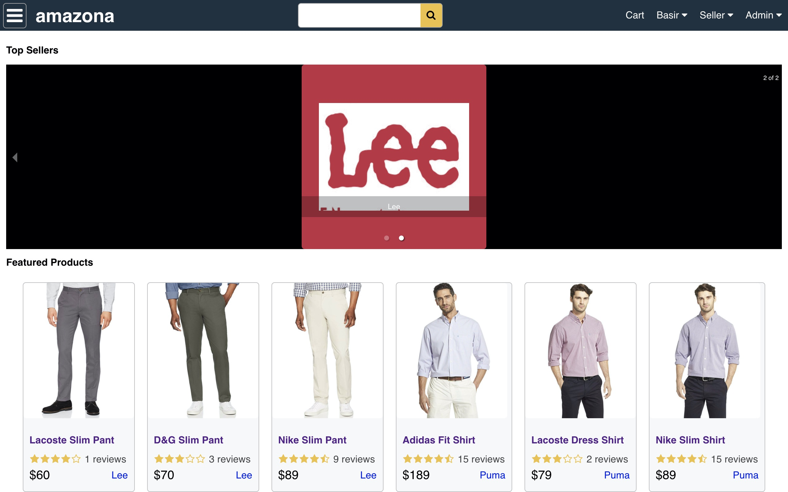

# MERN AMAZON


Sure! Here's a quirky and fun README description for your MERN Amazon project:

---

# 🚀 MERN Amazon Clone 🉠 
**Welcome to the Ultimate MERN Adventure!**

Ever dreamed of building your very own Amazon-style e-commerce website? Well, dream no more because we’re about to turn that into a reality (minus the whole billionaire status... for now ğŸ˜).

I present to you... **MERN Amazon** – a fully-functional e-commerce website built using the MERN stack (MongoDB, ExpressJS, React, and Node.js)! It's like Amazon, but *way cooler* because YOU made it!

## ğŸ› ï¸ What's Inside?

### 💻 **Frontend**: 
- **React.js**: Making your shopping cart and browsing experience buttery smooth and dynamic! Users will be hooked with the seamless experience.
- **HTML/CSS**: Because we like our web pages looking fine and fabulous (like the runway, but for code)!
- **JavaScript**: Bringing your site to life, adding interactivity, and letting users experience the magic of the web (with a sprinkle of awesome).

### ğŸ–¥ï¸ **Backend**:
- **Node.js**: The silent engine that powers the server-side like a boss. Handles all those requests, so you don’t have to!
- **Express.js**: My right-hand framework, helping me manage routes and APIs like a traffic controller on Black Friday.
- **JWT Authentication**: Because security is no joke! We’re making sure only the cool (and authorized) cats can log in.

### ğŸ—ƒï¸ **Database**:  
- **MongoDB**: Storing all your products, user profiles, and order info like a vault full of treasures (no, seriously, your stuff is safe here).

## 🤖 Fancy Features:

- 🛒 **Shopping Cart**: Add it, love it, buy it, or... remove it (but why would you? 🥺)
- 🔑 **User Authentication**: Sign up, sign in, sign out... repeat. It's like your favorite security dance.
- ğŸ›ï¸ **Product Browsing**: Efficient search and filtering, so your users can find what they’re looking for faster than a ninja.
- 🧾 **Order Management**: Keep track of all those orders, and maybe even feel like an e-commerce tycoon.

## 💸 BONUS: PayPal Integration!
Because who doesn’t like seamless, secure online payments? 💰 Just whip out your PayPal sandbox account and start “making it rain†(fake money, of course).

---

### Disclaimer: 
This project may make you feel like Jeff Bezos 💪. Side effects include sudden urges to build rockets 🚀, become a trillionaire 💵, or open an online bookstore 📚.

---





##  Run Locally


### 1. Clone repo

```
$ git clone git@github.com:RudraMudra/React-Amazon.git
$ cd Amazon

```

### 2. Setup MongoDB

- Local MongoDB
  - Install it from [here](https://www.mongodb.com/try/download/community)
  - Create .env file in root folder
  - Set MONGODB_URL=mongodb://localhost/amazona
- Atlas Cloud MongoDB
  - Create database at [https://cloud.mongodb.com](https://cloud.mongodb.com)
  - Create .env file in root folder
  - Set MONGODB_URL=mongodb+srv://your-db-connection

  
### 3. Run Backend

```
$ npm install
$ npm start
```


### 4. Run Frontend

```
# open new terminal
$ cd frontend
$ npm install
$ npm start
```

### 5. Seed Users and Products

  - Run this on chrome: http://localhost:5000/api/users/seed
  - It returns admin email and password
  - Run this on chrome: http://localhost:5000/api/products/seed
  - It creates 6 sample products

### 6. Admin Login

  - Run http://localhost:3000/signin
  - Enter admin email and password and click signin
>>>>>>> 59b165335cc390fd11a6d521c88209eba39ad054
